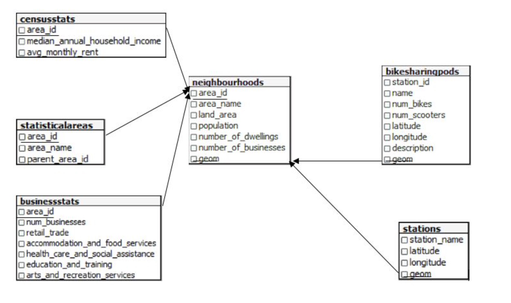
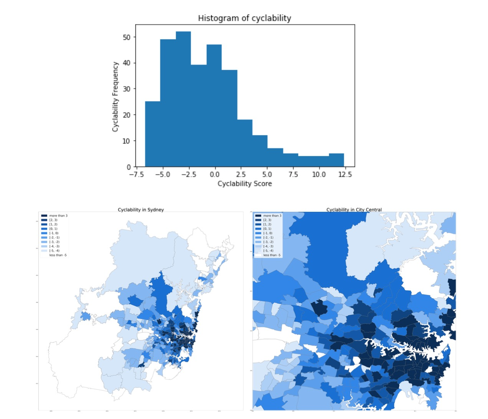
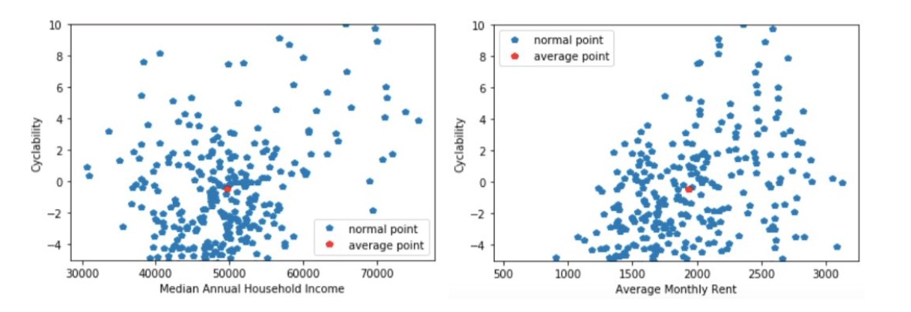

# Chloe-Project-3-PostgreSQL

For project 3, I used Azure Database for PostgreSQL with Postgis extension performed a cyclability score analysis in Greater Sydney Area. The cyclability score measures whether an area is cycling friendly based on population, dwelling density, business balance, bikepods density and station diversity. This project mainly used jupyter notebook to do analysis but stored all data into relational database in Azure. If you are interested in all the technical details of this project, feel free to read all the text below.

## 1.1 Dataset Description
### 1.1.1 Source of CSV files
The main source of all the given CSV files with Statistical Area 2 (SA2) data is from the Australian Bureau of Statistics (ABS). Statistical Area 2 keeps track of the information about communities’ social and economic interactions. BusinessStat.csv grouped business counts by industry in Greater Sydney. Neighbourhoods.csv and CensusStats.csv are retrieved from census data of Greater Sydney. Bikesharingpods.csv is given from Canvas.
### 1.1.2 Pre-process of CSV files
After connecting to the database, the same cleaning process is applied for all 5 provided tables by a clean() function. For instance, we replace all the null values of each attribute in the ”BusinessStats” table into a DEFAULT_VALUE = 0, which is reasonable to recognize any missing data as “0” in order to pursue any further arithmetic operation, such as calculating the population density and business density.
### 1.1.3 Source of additional transport station data
Web scraping is the vital process we obtained this additional transport station schema. The major source is (https://en.wikipedia.org/wiki/List_of_Sydney_Trains_railway_stations) from Wikipedia. However, we notice that a list of all the station names in Sydney is required to be given because each station linking to a new page contains the station’s specific longitude and altitude, which are what we expect to obtain for the “geom” attribute. So we store all the station names in a list and request to get the HTML code and use the BeautifulSoup library to find all the station links in the page. Then we iteratively visit all stations' website and try to obtain the longitude and altitude of the train station and store them into a list named “station_data”. It is essential to find the <a> tag in the table with class 'external text'. Since the web scraping takes a long time, we store the web scraping data as a CSV file to open and reuse it later.

## 1.2 Database Description
### 1.2.1 Database Schema integration
Each table will generate a schema with all the attributes by “CREATE TABLE” statement. Then we apply the “INSERT INTO BusinessStats() VALUES ()” to insert each row through pgquery(). The schemas of “CensusStats”, “StatisticalAreas”, “BusinessStats” all obtain the “area_id” attribute as the foreign key that references to the primary key “area_id” in “NeighBourhoods” schema. However, it is essentially required to implement a spatial join between “Neighbourhoods”, “BikeSharingPods” and “Stations” schemas since they do not have a sharing attribute.
The abstract idea of the spatial join is to find the longitude and altitude of all the adjacent points of a boundary of a polygon by a shapefile and set them as a column of geometry through “geom GEOMETRY(Polygon,4326)” in “Neighbourhoods” schema. Then we find the geometry position of each bike-sharing pods and check whether they are in a geometry polygon of “neighborhoods”. Our aim is to join all bike-sharing pods to the area which contains them. We will discuss the shapefile below.

For “BikeSharingPods” schema, each pot is recognized as a point with a pair of known longitude and altitude. As a result, we can simply convert them into a string format: row['geom'] = "POINT(" + str(row['longitude']) + " " + str(row['latitude']) + ")" so that we obtain a column of “geom” data for each bike sharing pot. Then we insert all the attributes from the original table plus the added “geom GEOMETRY(Point,4326)”. The additional transport station data made the same procedure to have a “geom” column based on each station’s longitude and altitude from web scraping.

### 1.2.2 Shapefile
We read a shapefile “SA2_2016_AUST.shp” and store its shapes() and records(). Next, we find all the area name in the neighbourhood.csv file and store in a list in order to match the area name in the shapefile. By checking, there are exactly 312 distinct areas in both neighbourhood.csv file and shapefile. So we do not need to change the format of the area name format. In the end, we insert all the rows of “Neighbourhoods” table into the schema including the “ST_GEOMFROMTEXT” attribute. Now, “ST_GEOMFROMTEXT” attribute contains a collection of all the continuous points of a boundary of an area which is the geometry polygon of that area.

### 1.2.3 Spatial Join
By now, “Neighbourhoods” schema has a “geom” attribute representing all the adjacent points of a boundary of a polygon. “BikeSharingPods” and “Stations” schemas both keep a “geom” attribute that represents a point. Considering not all neighborhoods have a bike-sharing pod, we use the “left outer join” to keep all neighborhoods, The spatial join will be implemented through ST_Contains(), such as “FROM Neighborhoods LEFT OUTER JOIN Bikesharingpods ON ST_Contains(Neighbourhoods.geom, Bikesharingpods.geom)” and “FROM Neighbourhoods LEFT OUTER JOIN Stations ON ST_Contains(Neighbourhoods.geom, Stations.geom)”. It shows a point of bike sharing pot or a station is contained by an area in “Neighbourhoods” schema.

There are totally 6 schemas in our database. 5 schemas are created based on the tables from ABS. The sixth schema of stations is sourced from the web scraping. The attributes of “area_id” and “geom” in “Neighborhoods” are two primary keys that connecting all the other 5 schemas.

### 1.2.4 Indexing
- We create an index on ‘area_name’ column of ‘Neighbourhoods’ table. Because when we want to filter the ‘Neighbourhood’ table, we usually use ‘area_name’ as the filter condition. For example, if we want to see the data of Camperdown, we search this area’s data by setting the ‘area_name’ to ‘Camperdown’. After creating this index, it can make it faster to find a specific area by its name.
- We create a spatial index on ‘geom’ column of ‘Neighbourhoods’ table. Considering we need to do two spatial join operations: ‘Neighbourhoods’ table with ‘Bikesharingpods’ table and ‘Neighbourhoods’ table with ‘Stations’ table. Both join operations use ‘geom’ column in the ‘Neighbourhoods’ table and they are both spatial join which may spend a lot of time, so we create the second index on geom’ column of ‘Neighbourhoods’ table to speed up these two join operations.

## 2.1 Cyclability Analysis
### 2.1.1 Cyclability formula
cyclability = z(population density) + z(dwelling density) + z(retail_trade density) + z(business density) + z(accommodation_and_food_services density) + z(education_and_training) + z(arts_and_recreation_services density) + z(bikepod density) + z(station accessibility)
Where z(density, x) = (x - AVG(density))/ (STDDEV(density)).

Our cyclability score measures whether an area is cycling friendly based on population, dwelling density, business balance, bikepods density and station diversity. We would expect that an area with a large population and dwelling density will be needier in relation to daily commuting transport such as biking. Meanwhile, station density can be an index of the convenience level for cyclist access to public transport. A higher retail store density along with accommodation and food service density means it will be easier to get living substances by bike. One can get public services more efficiently if an area has high health care and social assistance density since they can ride there. Arts and recreation services density and education density will give us some clues of the accessibility of infrastructure construction. Owing to the fact that the more services can we get within a cycling distance, the more likely this area is cycling friendly. Otherwise, people would go with driving. Finally, a high bike pods density score shows that it will be much easier for cyclists to find a parking place.

### 2.1.2 Histogram of cyclability and Visualization on map

The distribution of the cyclability of each area in Sydney is shown on histogram. It can be seen that the highest concentration of the cyclability scores of Sydney suburbs is the interval of [-3.75,-2.5]. The cyclability score in Sydney is relatively low since area amount with a score under 1.25 has accounted for an overwhelming proportion, detected by the left-skewed histogram.

Since we noticed that most of the values of cyclability of suburbs are centrally and quite evenly distributed from -5 to 3 through the histogram. There are some outliers that are much greater than 3 then we record them in an interval of “more than 3”. We set 10 intervals in total: less than -5, [-5, -4), [-4, -3), [-3, -2), [-2, -1), [-1, 0), [0, 1), [1, 2), [2, 3) and more than 3. As a result, the map displays all the suburbs shaded by 10 distinct colours. Each colour represents a level that the cyclability of this area is in and a higher cyclability score is associated with a darker colour on the map. It is clear to view that most of the dark colours are concentrated at the centre of Sydney and the cyclability is spreadly decreased from the CBD towards the rural areas.

## 2.2 Correlation Analysis
### 2.2.1 Scatter plots for exploring two relationships: Cyclability vs. Median annual household income and Cyclability vs. Average monthly rent

In general, the correlation coefficient is in the range of [-1, 1]. We recognize: [-1, -0.75] as a strong negative association, [-0.5, -0.74] as a moderate negative association, [-0.25, -0.49] as a weak negative association, [-0.24, +0.24] as no association, [+0.25, +0.49] as a weak positive association, [+0.5, +0.74] as a moderate positive association and range [+0.75, +1] as a strong positive association.

### 2.2.2 Cyclability vs. Median annual household income
There is a weak uphill linear relationship between cyclability score and median annual household income. The median household income in concentrated around 40000-60000, whereas the cyclability score is only concentrated in the range of -4 to 2 with higher scores spread randomly. In this case, there is no strong relationship between cyclability and median annual household income due to a correlation coefficient value of 0.36202106 we calculated. This result can be explained that most people’s incomes are in between 40000 to 60000, and they are the major market of bike riding. For those with high salaries, they might not tend to choose cycling, instead, they may prefer driving.

### 2.2.3 Cyclability vs. Average monthly rent
The cyclability score has a weak positive association with average monthly rent since the correlation coefficient is 0.44080353. The lowest average monthly price is from approximately 1000, then a generally trending is that with the increase of house monthly rent, the cyclability tends to increase. However, there are still quite a few areas with high house rent but low cyclability scores. Perhaps the most expensive area is usually in the outskirt, where the environment will be better than the city centre. Based on research conducted by Rent.com.au, it is clear that the top ten most expensive rent suburb are concentrated in North Sydney, especially those with sea-view, while Sydney is only at the tenth place. This means fewer people can afford to live in these areas, but less business activity, less public transportation in comparison to city central.
